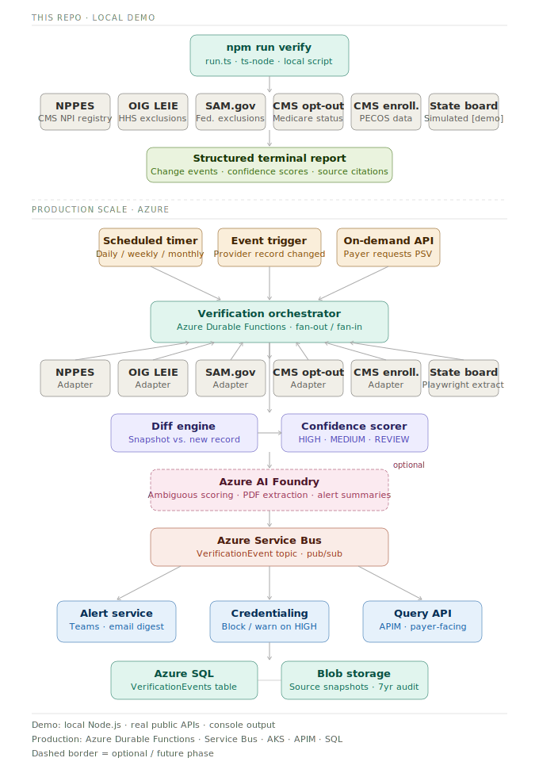

# Provider Verification Agent

[](https://codespaces.new/mttwhlly/pva)

A working demonstration of continuous provider data enrichment — the same pattern
used by Parallel Web Systems, applied to CAQH's core domain.

Instead of waiting for providers to self-attest, an agent hits authoritative public
sources directly and surfaces what changed, where it came from, and how confident
it is in the signal.

**No API keys. No cloud setup. Just Node and real government databases.**

---



---

## Setup (2 minutes)

Requires Node.js 18+. On a Mac: `brew install node`

```bash
npm install
npm run verify
```

That's it.

---

## What it does

Checks providers against 6 public authoritative sources in parallel:

| Source | What it checks | Auth |
|---|---|---|
| **NPPES / NPI Registry** (CMS) | Name, address, taxonomy, deactivation status | None |
| **OIG LEIE** (HHS) | Federal exclusions — billing ineligibility | None |
| **SAM.gov** (GSA) | Federal procurement exclusions | Public DEMO key |
| **CMS Medicare Opt-Out** | Provider opted out of Medicare | None |
| **CMS Medicare Enrollment** (PECOS) | Enrollment status, specialty, PAC ID | None |
| **State Board** | License status, expiration, disciplinary actions | Simulated in demo* |

*Real implementation uses per-state Playwright extraction. The adapter interface and
diff logic are identical — swap the fetch function, keep everything else.

For each provider it:

1. Fetches current data from all six sources simultaneously (`Promise.all`)
2. Diffs against the last known snapshot (stored in `./snapshots/`)
3. Scores each change: `HIGH` / `MEDIUM` / `REVIEW_NEEDED`
4. Prints a structured verification report with source citations

On first run everything shows as `FIRST_SEEN` (no prior snapshot).
On second run it detects only what actually changed.

---

## Simulate a change

After the first run, open any file in `./snapshots/` and edit a value:

- Flip `"excluded": false` to `"excluded": true` in the OIG record → fires a `HIGH` flag
- Change `"status": "ACTIVE"` to `"SUSPENDED"` in the state board record → fires a `HIGH` flag
- Change an address field in the NPPES record → fires a `MEDIUM` flag

Run again. The diff engine fires only on what changed.

---

## Example output

```
──────────────────────────────────────────────────────────────────
  CAQH Provider Verification Agent
  2025-01-15T06:00:00Z
  4 providers · 6 sources · 3 changes detected
──────────────────────────────────────────────────────────────────

  🚨 Dr. Robert Jones MD · Physician
     NPI 1679576722  ·  [HIGH FLAG]

     NPPES / NPI Registry   Active · Internal Medicine · Chicago, IL
     OIG LEIE               Not excluded
     SAM.gov                Not excluded
     Medicare Opt-Out       Not opted out
     Medicare Enrollment    Enrolled · Individual · Internal Medicine
     State Board (FL) [sim] ACTIVE · exp 2025-10-31 · 1 disciplinary action(s)

     -- Changes detected (1) --------------------------------
       [HIGH]  STATE_BOARD · disciplinaryAction
         First seen : Letter of Concern (2024-08-15): Prescribing practices review
         Source     : https://www.fsmb.org/physician-data-center/state-medical-boards/
         Confidence : 0.90
```

---

## The bigger picture

This is a proof of concept. At production scale for CAQH this becomes:

- **Azure Durable Functions** — scheduled fan-out orchestration, retries, distributed
- **Azure Service Bus** — events routed to credentialing workflow, Teams alerts, audit log
- **State board adapters** — Playwright extraction for 50+ state medical board sites
- **VerificationEvents table** — Azure SQL, append-only, 7-year retention for regulatory audit
- **Verification Query API** — behind APIM, payer-facing real-time PSV as a service

The pattern is identical to what Parallel Web Systems sells as infrastructure.
The difference is CAQH already owns the domain, the relationships, and the data context
to make this genuinely authoritative rather than just a web search layer.

---

## File structure

```
provider-verify/
├── CLAUDE.md                        <- Claude Code bootstrap instructions
├── README.md
├── data/
│   └── providers.json               <- NPIs to check
├── snapshots/                       <- written at runtime, gitignored
│   └── {npi}.json
├── docs/
│   └── architecture.svg             <- embedded above
└── src/
    ├── nucc.ts                      <- NUCC taxonomy crosswalk (bundled)
    ├── types.ts                     <- shared interfaces
    ├── store.ts                     <- snapshot read/write
    ├── diff.ts                      <- change detection + confidence scoring
    ├── run.ts                       <- main orchestrator + report printer
    └── adapters/
        ├── nppes.ts
        ├── oig.ts
        ├── sam.ts
        ├── medicare-optout.ts
        ├── medicare-enrollment.ts
        └── state-board.ts           <- simulated; replace with Playwright for prod
```

---

*Built with Claude Code as a pattern demonstration.*
